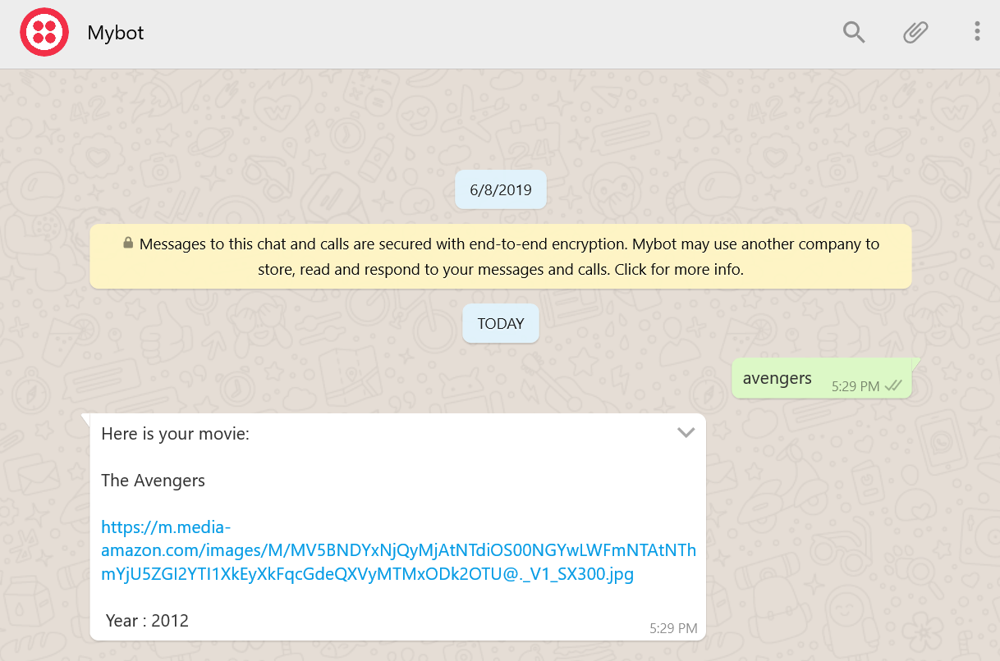
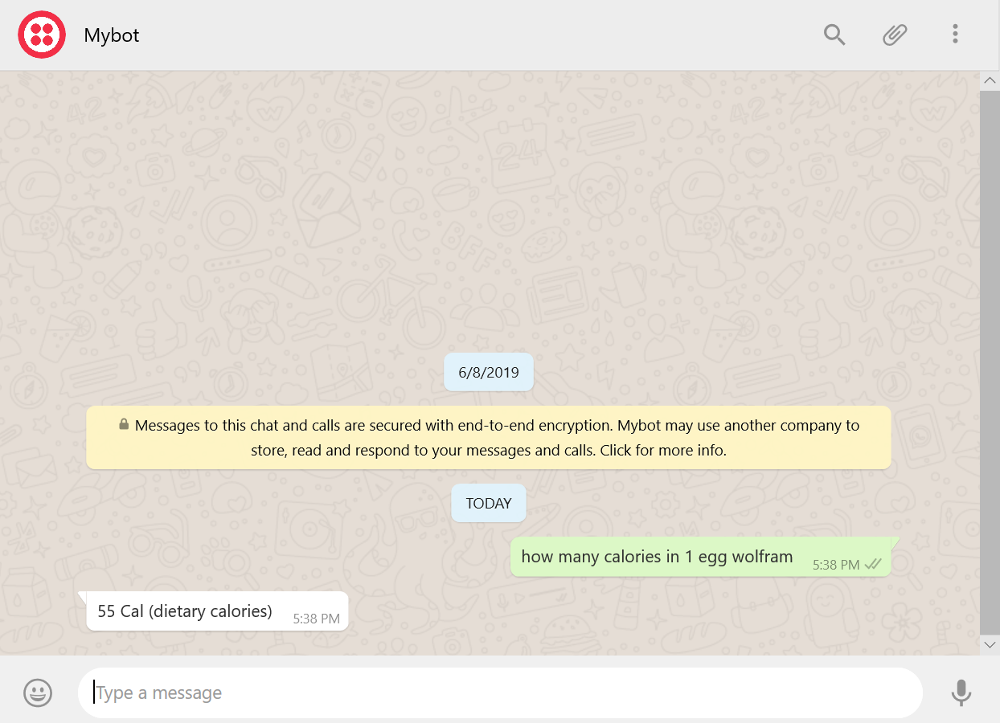

# WhatsApp ChatBot

A simple chatbot which answers to user queries

## Getting Started

To run my chatbot on your mobile follow below instructions

### Prerequisites

You need to have WhatsApp Application. If you don't have download it from play store on your mobile

### Getting Started

Save +1 415 523 8886 on your mobile
and whatsapp "join drop-series" without quotations and you will recieve a message from twilio
now you are all set to talk with my bot

## Asking Queries

### This chatbot can give you the movie details just type the movie name

### You can ask news

### You can do wiki search by using keywords like wiki, info, summary

### If you want to do google search you can do by using keyword wolfram

## Built With

* Python3
* Twilio
* Google Dialogflow
* MongoDB
* Google Cloud
* Wolfram api
* gnewsclient api
* Flask
* OMDB api

All the required libraries can be found in requirement.txt file
